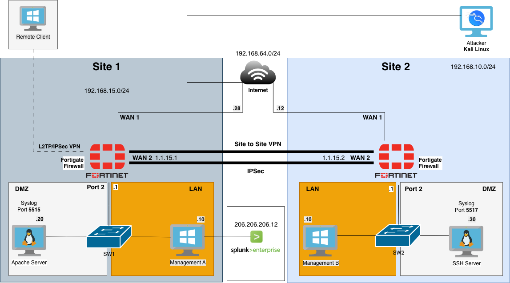
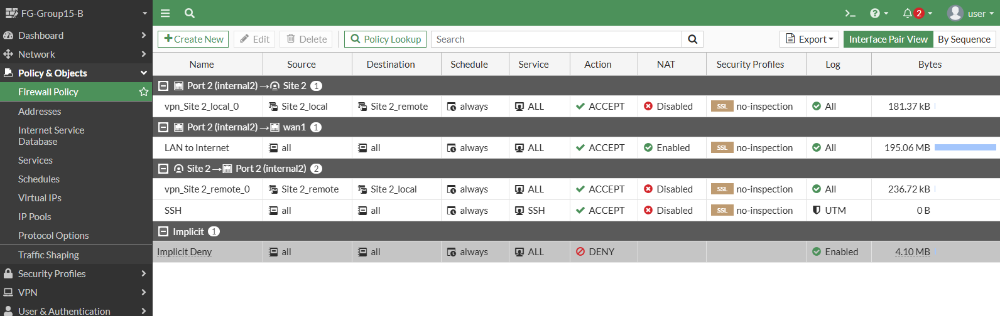
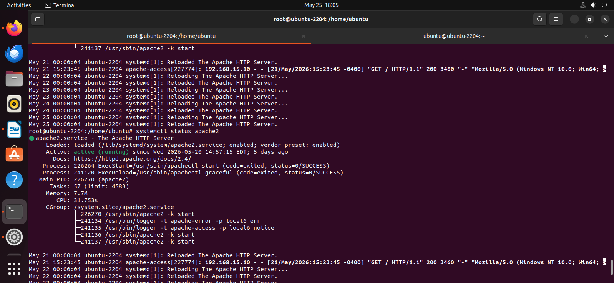
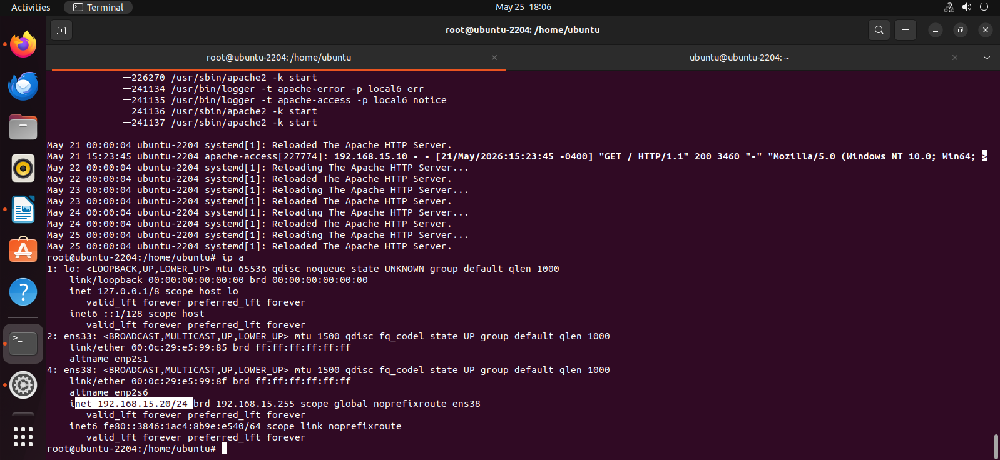
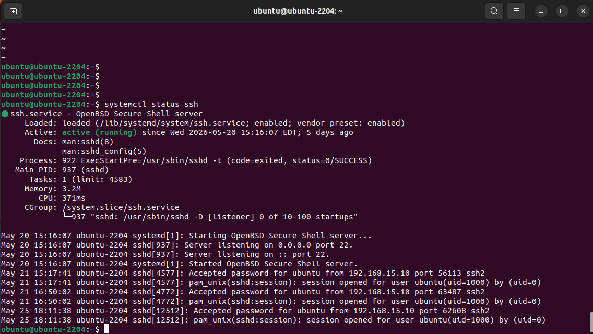
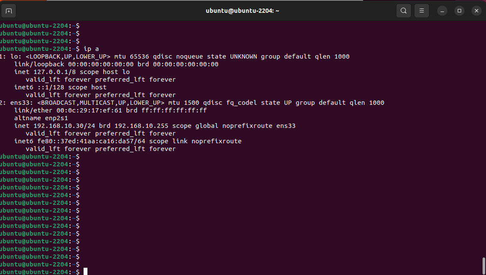
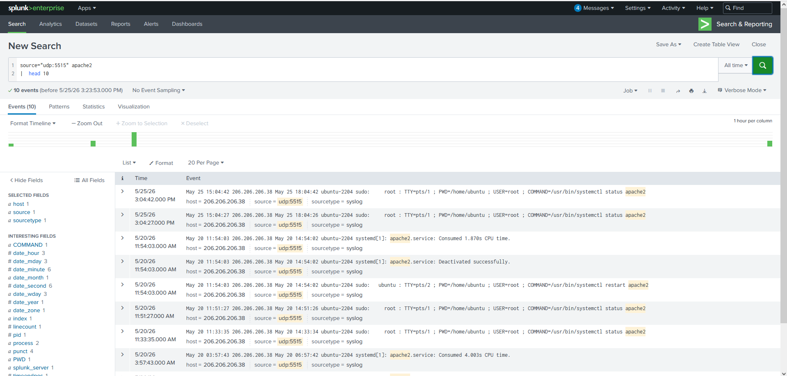

# 4390 Enterprise Network Security & Monitoring Capstone
*Group 15 | Anthony, Justin N., Justin W, Kelvin, Nathan, Ze*

## Project Objective
This repository contains the full documentation, configuration files, and verification for the design and implementation of a secure enterprise network. 
The infrastructure connects two branch offices and remote users, featuring multi-vendor firewalls, centralized Splunk logging, and simulated cyber attack detection.

---

## 1. Network Design & Architecture

### Topology Diagram

> *`Network Diagram`*

### 1.2 IP Addressing Scheme
The network utilizes a subnetted IP addressing scheme separating core functions:
* **LAN:** `Site 1: 192.168.15.0/24, Site 2: 192.168.10.0/24`
* **DMZ:** `Site 1: 192.168.15.20, Site 2: 192.168.10.30`
* **Management:** `Site 1: 192.168.15.10/24, Site 2: 192.168.10.10/24`

---

## 2. Infrastructure & Configuration

### 2.1 Firewalls
This setup utilizes two different firewalls to secure the network edge and internal segments.

**Site 1: FortiGate (Group 15-A)**
* 

**Site 2: [Insert Second Vendor - e.g., Palo Alto / Checkpoint]**
> **[TODO: Add configuration files and policy screenshots for the second firewall]**

### 2.2 Server Deployment
Internal services hosted within the servers.

* **Apache Web Server**
  
  
* **SSH Server**
  
  

### 2.3 DoS Protection

---

## 3. VPN Implementation

### 3.1 Site-to-Site VPN
## IPsec tunnel established between the FortiGate firewalls.
Site 1 Tunnel Up

Site 1 Tunnel Configuration

Site 2 Tunnel Up

Site 2 Tunnel Configuration

### 3.2 Client-Based VPN (Remote Access)
Tunnel Up 

Tunnel Config
VPN User

---

## 4. Centralized Logging & Splunk
*(Evaluation Weight: 20%)*

All network components (Firewalls, Servers, VPNs) are configured to forward logs to a centralized Splunk instance for monitoring and correlation.

### 4.1 Log Generation (Syslogs)
* **FortiGate Logs:**
  
  
* **Apache & Server Logs:**
  
  

### 4.2 Splunk Dashboards

---

## 5. Attack Simulation & Detection

To validate the security posture and monitoring capabilities, controlled attacks were simulated using Kali Linux.

### 5.1 Port Scan (Nmap)
> **[TODO: Insert screenshot of the Nmap scan being executed from Kali]**
> **Splunk Detection:** > **[TODO: Insert screenshot showing how Splunk detected the Nmap scan and briefly explain the findings]**

### 5.2 Brute Force Attack (SSH/RDP)
> **[TODO: Insert screenshot of the Brute Force tool (e.g., Hydra) running]**
> **Splunk Detection:**
> **[TODO: Insert screenshot showing Splunk alerting on multiple failed login attempts and explain the findings]**

### 6. Fortigate Configuration Files Sanitized 
* [FortiGate Configuration Backup (Raw)](FG-Group15-A_7-2_1762_202605261026.conf)
* [FortiGate Configuration (YAML)](FG-Group15-A_7-2_1762_202605261026.conf.yaml)
